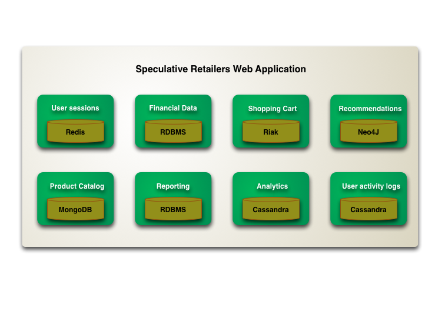

# [Architecture for Containerized .NET Applications](https://docs.microsoft.com/en-us/dotnet/architecture/microservices/)

* When you design a container image, you'll see an [ENTRYPOINT]() definition in the Dockerfile. This definition defines the process whose lifetime controls the lifetime of the container.
* Because containers are immutable by design, you never need to worry about corrupted VMs.
* The following solutions are used to manage data in Docker applications:

    From the Docker host, as Docker Volumes:

    - **Volumes** are stored in an area of the host filesystem that's managed by Docker.

    - **Bind mounts** can map to any folder in the host filesystem, so access can't be controlled from Docker process and can pose a security risk as a container could access sensitive OS folders.

    - **tmpfs mounts** are like virtual folders that only exist in the host's memory and are never written to the filesystem.

    From remote storage:

    - **Azure Storage**, which provides geo-distributable storage, providing a good long-term persistence solution for containers.

    - Remote relational databases like **Azure SQL Database **or NoSQL databases like Azure Cosmos DB, or cache services like Redis.

    From the Docker container:

    - **Overlay File System**. This Docker feature implements a copy-on-write task that stores updated information to the root file system of the container. That information is "on top" of the original image on which the container is based. If the container is deleted from the system, those changes are lost. Therefore, while it's possible to save the state of a container within its local storage, designing a system around this would conflict with the premise of container design, which by default is stateless.
* In the traditional approach, there's a single database shared across all services, typically in a tiered architecture. In the microservices approach, each microservice owns its model/data.
* DDD benefits from microservices by getting real boundaries in the form of distributed microservices. But ideas like not sharing the model between microservices are what you also want in a Bounded Context.
* Challenges and solutions for distributed data management
    1. How to define the boundaries of each microservice?
    2. How to create queries that retrieve data from several microservices?

        The most popular solutions are the following.
        - API Gateway
        - CQRS with query/reads tables
        - "Cold Data" in central databases.
    3. How to achieve consistency across multiple microservices?
    4. How to design communication across microservice boundaries?

        Issues with chaining http calls:
        - Blocking & low performance
        - Coupling microservices with http
        - Failure in any one microservice

* It's recommended that you use only asynchronous interaction for inter-microservice communication, either by using asynchronous message- and event-based communication, or by using (asynchronous) HTTP polling independently of the original HTTP request/response cycle.
* A 'Bounded Context' could be composed of several physical services, but not vice versa.

* A direct client-to-microservice communication architecture could be good enough for a small microservice-based application, especially if the client app is a server-side web application like an ASP.NET MVC app. However, when you build large and complex microservice-based applications (for example, when handling dozens of microservice types), and especially when the client apps are remote mobile apps or SPA web applications, that approach faces a few issues.
* Issues with the absence of API Gateway and client directly communicates with backend:
    * Coupling
    * Too many round trips:
    * Security issues
    * Cross-cutting concerns
* The API Gateway pattern is also sometimes known as the "backend for frontend" (BFF) because you build it while thinking about the needs of the client app.
* Main features in the API Gateway pattern:
    * [Reverse proxy or gateway routing](https://docs.microsoft.com/en-us/azure/architecture/patterns/gateway-routing)
    * [Requests aggregation](https://docs.microsoft.com/en-us/azure/architecture/patterns/gateway-aggregation)
    * [Cross-cutting concerns or gateway offloading](https://docs.microsoft.com/en-us/azure/architecture/patterns/gateway-offloading)
* Client and services can communicate through many different types of communication, each one targeting a different scenario and goals. Initially, those types of communications can be classified in two axes.

    The first axis defines if the protocol is synchronous or asynchronous:
    * Synchronous Protocol - HTTP
    * Asynchronous Protocol - AMQP

    The second axis defines if the communication has a single receiver or multiple receivers:
    * Single Receiver - Command Pattern
    * Multiple Receiver - pub/sub in event driven architecture.
*  In synchronous communication a "chain" of requests is created between microservices while serving the client request. This is an anti-pattern. In asynchronous communication microservices use asynchronous messages or http polling to communicate with other microservices, but the client request is served right away.
* If your initial microservice needs data that's originally owned by other microservices, do not rely on making synchronous requests for that data. Instead, replicate or propagate that data (only the attributes you need) into the initial service's database by using eventual consistency. (typically by using integration events)
* In a real production environment, for high availability and for scalability, the databases should be based on database servers in the cloud or on-premises, but not in containers.
* If you want to create accurate integration tests that take into account the behavior of a specific database implementation, you need to use a real database like SQL Server. For that purpose, running SQL Server in a container is a great choice and more accurate than the EF Core InMemory database provider.
* It's important to understand that CQRS and most DDD patterns (like DDD layers or a domain model with aggregates) are not architectural styles, but only architecture patterns. Microservices, SOA, and event-driven architecture (EDA) are examples of architectural styles. 
* If two microservices need to collaborate a lot with each other, they should probably be the same microservice.
* Dependencies in a DDD Service, the Application layer depends on Domain and Infrastructure, and Infrastructure depends on Domain, but Domain doesn't depend on any layer. 
*  Unit tests use fakes or mock objects in place of these concerns. But the purpose of integration tests is to confirm that the system works as expected with these systems, so for integration testing you do not use fakes or mock objects. Instead, you include the infrastructure, like database access or service invocation from other services.
* Implement background tasks in microservices with `IHostedService` and the `BackgroundService` class: If your background tasks have nothing to do with HTTP (IWebHost) you should use IHost. Its main benefit is the opportunity you get with the graceful cancellation to clean-up the code of your background tasks when the host itself is shutting down.
*  Command Query Separation (CQS): The basic idea is that you can divide a system's operations into two sharply separated categories:

    * Queries. These queries return a result and do not change the state of the system, and they are free of side effects.

    * Commands. These commands change the state of a system.
*  If a microservice must rely on another service to directly service a request, it is not truly autonomous.